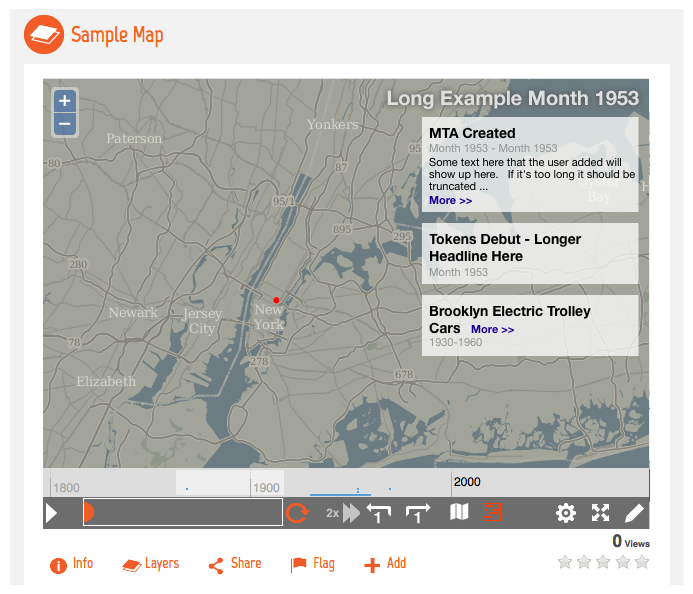
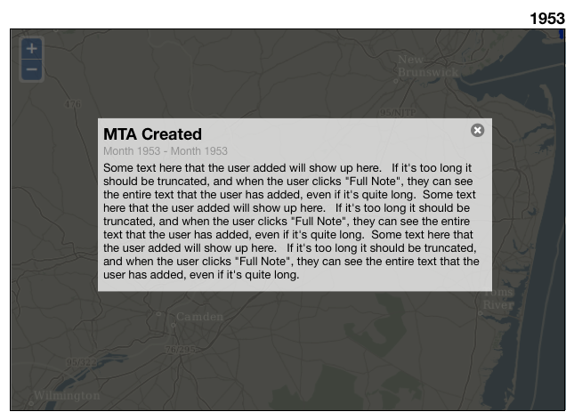
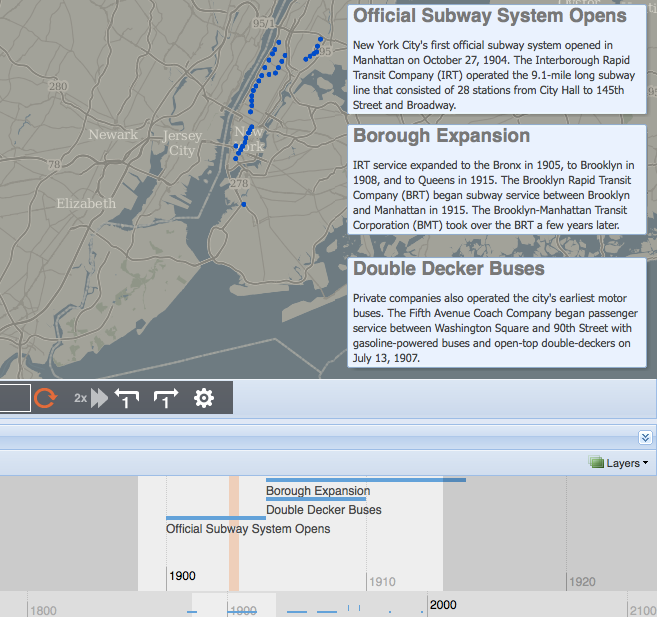

## Annotations Improvements Part 2 

Learning from the work done in the [first round](annotations.md) of annotation work this will mostly be
focused on user testing and improving in the ways that real people are interested in. We also have
some older wireframes that focus on annotations and timeline in the small map view, which would be 
good to do too.

### Requirements

Learn from users, and get annotations working really well.

### User Strories

As a user, I want to make sure my StoryPins can extend back to the same geologic time scale as my layers. 	

As a user, I need be able to define the time range for my StoryPins by clicking on the timeline, rather than selecting in a calendar box.

### Wireframes/design

#### Timeline-Related UI Updates

To address:
 * Issue 399 - Show timeline / annotations on small map
 * Issue 401 - Evaluate when we show annotations on map 

##### Timeline / Annotations on Small Map (399)

**Example (draft -- wireframe only)**

**Example - Viewing Full Note Text (draft -- wireframe only)**

**Summary - Changes to Small Map View**

 * Move map controls below map, position controls flush left to the map (see wireframe)
 * Add button to map controls to toggle timeline, but don’t show unless map has a timeline
 * For maps with a timeline:
  - Show the button to allow the user to toggle the timeline/annotations 
  - Show annotations 
  - When map is playing, timeline behavior is the same as in the Map Composer
  - Restrict timeline to range where data are available
 * Timeline Items (Annotations)
  - Create new style of showing timeline items
  - Support “stacking” of annotations that are configured to appear in the same area
  - Apply new style to larger map as well
  - Create way to view the full annotation if text if too long to fit on the map
 * Legend Display
  - On small map view: exact behavior TBD.  Either allow only the legend OR timeline/annotations to be shown at a time, or allow both with the caveat that the two items can cover up most of the map.   
  - All other map views: support showing legend and timeline/annotations at the same time.  Exact positioning TBD, but likely we’d show the legend at the right, and any timeline items positioned at the right would be moved to the left of the legend.
 * Large Map View
  - The same changes should apply if possible, though we can show the full timeline instead of just the thin timeline
  - Can show more annotation text before truncating
 * Map Composer
  - This also has the “Layers” submenu when showing the timeline--so the timeline might have to still appear below the map in this case?  Need more info.

**Issues to Be Aware of**

 * The length of timeline items (title and notes) can vary greatly.  
 * A time point may have many time line items, resulting in a large list of items.
 * Current implementation: on map 89, there are timeline events in the year 1953, but I can’t select that year directly.  Guessing this is because 1953 didn’t have any data for the original dataset.  However, users would expect to be able to select that point in time directly because there are timeline items there.
   - See “Longer Term Improvements” below for more
   
**Logic**

|GIVEN|WHEN|THEN|
|-----|----|----|
There are multiple timeline items at the current time point|the user views the items|the user sees all timeline items for the current time point
“|“|the items are ordered by how close the item is to the current time point (with more recent items first)
“|“|for items that are ranged, the order is based on the start date of the item|
There is a timeline item that starts at the current time point|the user views that item|the user sees the timeline item’s title, time period, and note (if applicable)
There is a timeline item that encompasses the current time point but does not start on the current time point|the user views that item|the users sees the timeline item’s title, time period, and link to see the note (if appicable)
A timeline item’s note is more than ### characters long|the user views that item|the note is truncated at ### characters, sees a “ …” at the end of the note, and sees a link to view the full note below the truncated note
A timeline item does not have a note|the user views that item|the user never sees a truncated note or a link to view the full note
The user has clicked a link to view the full note text of an item|the user is viewing the note|the annotations are temporarily hidden on the map, a modal window appears with the item’s title, time period, and note text, there is a button to close the modal window, behind the window, the contents of the map darken (see mockup)
The user is viewing the full text of the note|the user clicks the close link or clicks outside of the modal window within the map area|the modal window closes, the map returns to its previous appearance, the annotations re-appear

**Small Improvements** 

 * Consider showing the timeline by default for maps that have timeline items.
 * Show the current time point in a more prominent location (example above--do base layer SLDs provide a text color that will be visible for most areas of the map?  if not, we might have to move it outside of the map)
 * Make the map a bit taller
 * Maybe not small: restrict timeline to the range that the data covers so that user doesn’t navigate to points where there is no data for the current map

**Longer-Term Improvements**

 * Improve handling of maps without a time component.  
  - Limited option: allow users to add annotations to the map itself, but not to any specific point in time, since they won’t be playable
  - Expanded option: if a map didn’t have time data but for some reason they want to add annotations at different points in time, allow them to do this, and allow playback of the annotations on the map.  (While there is a use case for this, I am not sure how common it will be for MapStory, since the focus is very much on the map.)
 * Playback: map data vs. timeline data -- this one will require more thought, but offhand: it might make sense to incorporate time points from the map and timeline data into the playback control.  
  - Main advantage: say a map’s data goes from 1995-2000.  But the user wants to add some context at 1994 and wants to add some notes after 2000 indicating future plans.  This change would allow those notes to appear during playback.
 * Consider integrating the timeline with the playback control.  This would keep the number of controls used to control map playback at one (instead of increasing it to two when the timeline is open).  
 * Consider updating the timeline control to let the user click items in the timeline to view them.  Would also require making the click targets of smaller items large enough to click.
 * Consider allowing the user to specify the type of time they’re using for a timeline item.  This has several advantages:
  - the user has to input less information.  If a timeline item is in years, they user can enter 1998-1999, for example, instead of 1/1/1998 - 12/31/2009.
  - we know what to display -- we can show 1998-1999 in the above example instead of 1/1/1998 and 12/31/2009.  
  - the information displayed is more accurate -- instead of forcing the user to input arbitrary months and/or dates when the information the user has isn’t that detailed, we can simply show the information that is available.  For example, if the user’s data shows that something happened March 1881, we can show March 1881 instead of March 1, 1881 or some other arbitrary date.

**Example maps with timeline items:**

* http://mapstory.dev.opengeo.org/maps/89/view
* http://mapstory.dev.opengeo.org/maps/117/view (same as 89 but has different annotations)

#### Timeline - Display Logic for Map Features/Annotations - Issue 401

**Wireframe (Draft)**

**Summary of Changes**
 * Change timeline so that:
   - The selected range that’s active on the smaller timeline is reflected on the larger timeline (darken the inactive parts)
   - Keep the current time indicator -- change color and width (details TBD -- still working on this to make it clearer that this is the current time indicator; other changes may be required)
 * Change map so that:
   -Any features or timeline items (annotations) that fall within the current range in the timeline are displayed

**Questions**

 * Do we have maps where timeline items are colored to correspond to (or otherwise associated with) a map feature, like on this TimeMap example?
 * Do we know how many timeline items/annotations maps have?  As you can see in the above mockup, we might have to revisit how we display annotations if we expand the 
 * In Map Composer: if user adds layers, what’re the implications?  Could this result in a very large number of data points being displayed?  Performance and/or display issues?

**Issues**
 * The subway map shows the expansion of subway systems, and some people might guess--but it seems like it would be more helpful to show the legend by default in some cases.
 * Side note: given the number of elements that could be visible on the map, the UI could become a little unwieldy if we started to distinguish between past/future events withiin the range of info that's being displayed--so I left that out of this batch of changes

