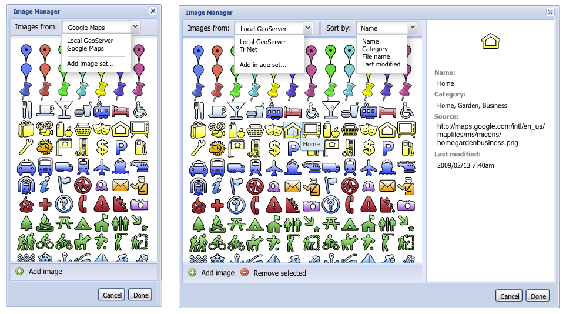

## Improve styler for better icons

We should be able to access nicer sets of icons than what SLD can create.

### Requirements/spec

This could be done in two parts, the first of which would not depend on the [Iconcommons](iconcommonds.md)
roadmap item.

First would be to extend the styling UI to allow selection of remote icons. Right now we just have a url
line to refer to an online icon. It would be nicer to display a set of icons to the user to select. 
Initially this could just be some static set of files we use to get the user interface right.

Second would be actually hooking up to Iconcommons. This should include some way to search or find
different icon sets. Should start with some nice default sets for users who are not interested in 
digging.

Another integration piece would be upload. Users should be able to upload styles through MapStory itself
and not necessarily have to worry about where it's hosting. But ideally in the backend we'd put their
icons on iconcommons.org, under their username.

### Tech plan/notes

May want to wait on a new styling framework in general, as that's something we've talked about, in
our [Storytelling Refresh](composer-new.md). Should work our strategy there first.

### Wireframes
The following need a complete refresh, as they are years old. But they get across the general idea.

### People
Mostly javascript.

### Issues
