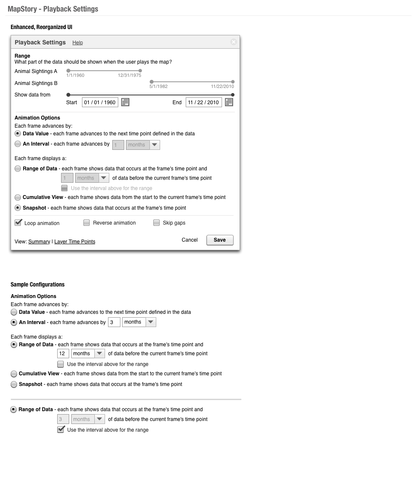
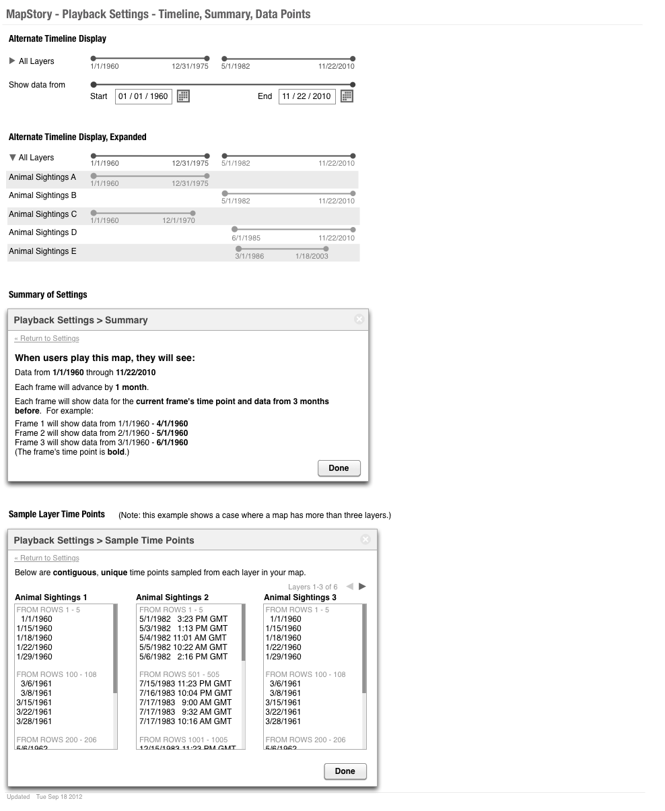
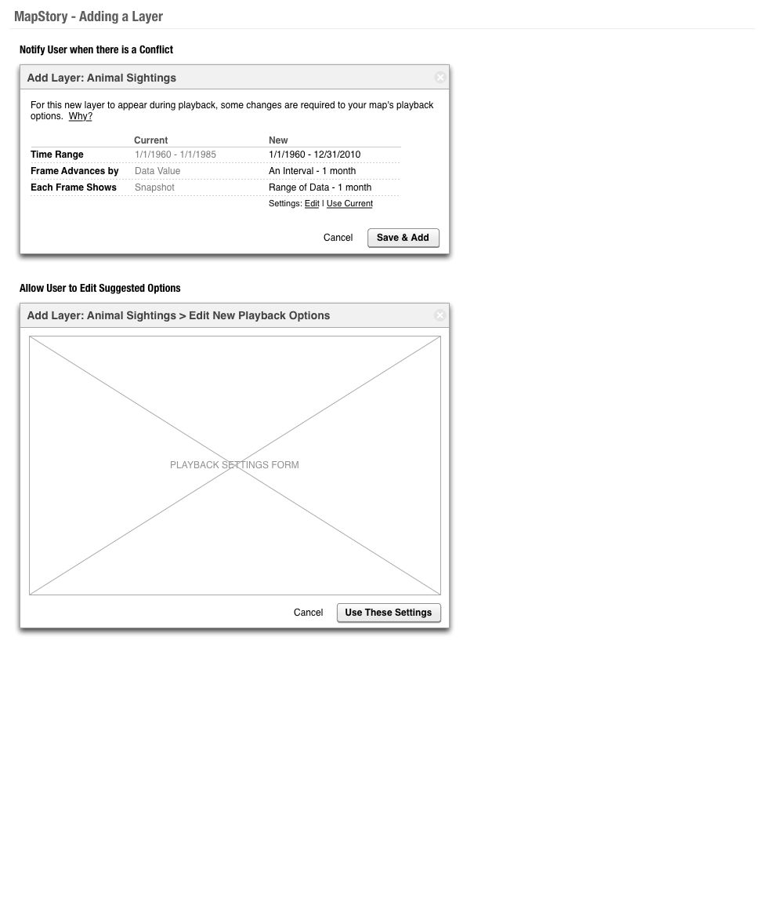

## Playback Settings

Improve the settings for playback, based on past wireframes

### Wireframes / design work

#### Revised UI for Playback Settings

Please discuss with UX before starting development--the below is preliminary and additional details need to be worked out prior to beginning development.

 * Language / wording to be finalized
 * Exact display of timelines for each layer subject to change; can revise depending on what options are available during implementation
 * Not yet shown:
    - validation, warnings, notes.  For example:
      * if using the trailing option, then note to the user that the first frame of the of playback is adjusted automatically
      * if using an interval, will want to set range of data in most cases; 
      * ensure valid dates/integers are input;
      * warn if there will be a large gap in playback (gap between datasets and user has set interval option); 
      * warn if playback will result in a very large number of frames, resulting in long playback time--e.g., data ranges for years but user has set playback to advance by days)
    - how the UI handles displaying long layer names
    - summary text for different configurations (will need to figure out the wording)
 * Skip Gap option is not currently implemented, but would allow for gaps in data to be skipped when advancing frames by interval
 * Aside from the UI updates, the following are also enhancements that are not yet implemented:
   - Showing timelines of map layers
   - Summary of playback settings (in plain English)
   - Sample Layer Time Points view
     * Additional points load as user scrolls
     * Shows a sample of points (this feature is intended to show users a sample of time points; it is not a data browser)

#### Errors and Warnings

 * Should be shown inside the window
 * If space is an issue:
   - expand window width and show error in a right column 
 * Error message should match error message style of updated uploader in MapStory

#### Resolving Playback Problems / Conflicts when Adding Layers
 * When layers are added, problems or conflicts with playback can arise.
 * The desired workflow is:
   - MapStory detects whether there is an issue or conflict when a user adds a layer
   - If there is, then MapStory determines settings that will allow playback to work
   - MapStory notifies the user of these settings and allows the user to:
     * See the new settings (and compare them to the old settings)
     * Accept the new settings as-is
     * Tweak the new settings before accepting them (If editing, include a way for user to restore the original proposed settings)
     * Cancel adding the layer
 * Additional notes will be added here.  Current notes are available in this Google Doc

